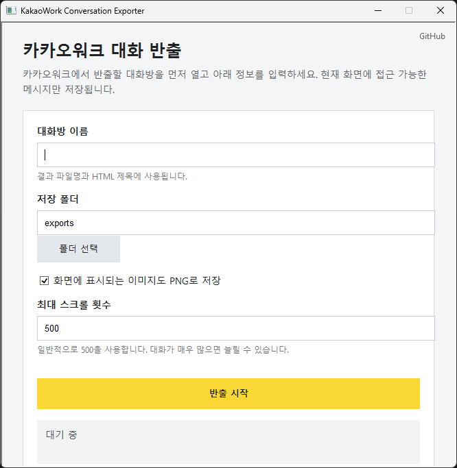

# KakaoWork Conversation Exporter

> 로그인된 Windows용 카카오워크에서 현재 열어 둔 대화방을 **HTML · JSON**으로
> 저장하는 PowerShell 도구입니다. 화면에 보이는 이미지도 PNG로 함께 보존합니다.

<p>
  
  
  
  
</p>

> [!WARNING]
> 이 프로젝트는 **카카오 / 카카오엔터프라이즈의 공식 도구가 아니며**, 어떤
> 형태로도 제휴되어 있지 않습니다. 사용에 따른 책임은 전적으로 사용자에게
> 있습니다. 업무용 대화 반출 전에는 반드시 [보안 및 법적 고지](#보안-및-법적-고지)를
> 읽어 주세요.



## 목차

- [주요 기능](#주요-기능)
- [동작 원리](#동작-원리)
- [요구 사항](#요구-사항)
- [빠른 시작](#빠른-시작)
- [터미널 실행 및 옵션](#터미널-실행-및-옵션)
- [결과물](#결과물)
- [저장 대상](#저장-대상)
- [처리 과정](#처리-과정)
- [문제 해결](#문제-해결)
- [제한 사항](#제한-사항)
- [보안 및 법적 고지](#보안-및-법적-고지)
- [라이선스](#라이선스)

## 주요 기능

- 현재 열어 둔 대화방을 사람이 읽는 **HTML**과 후처리용 **JSON**으로 동시 저장
- 화면에 표시되는 이미지를 **PNG**로 보존 (`-SkipImages`로 끌 수 있음)
- 실행 시 카카오워크 창을 자동으로 **복원·최대화·포그라운드** 처리
- `PrintWindow` 기반 캡처로 **다른 창이 겹쳐도** 깨끗하게 저장
- **DPI 인식** 처리로 125% / 150% 배율 화면에서 이미지 잘림 방지
- SHA-256 서명 기반 **중복 제거**, 긴 대화는 **체크포인트**로 중간 저장
- DB 복호화·인증 우회·서버 API 호출 **없음**

## 동작 원리

암호화된 로컬 DB를 복호화하거나 카카오워크 서버 API를 호출하지 않습니다.
Windows UI Automation을 사용해 카카오워크 화면에 표시된 메시지를 읽고,
메시지 목록을 위로 스크롤하며 과거 내용을 수집합니다.

실행 시작 시 카카오워크 창을 자동으로 복원·최대화하고 맨 앞으로 가져옵니다.
이미지는 화면 픽셀이 아니라 창이 직접 그린 내용을 `PrintWindow`로 캡처하므로,
다른 창이 위에 겹쳐도 깨끗하게 저장됩니다. 또한 프로세스를 DPI 인식으로
설정해 125% / 150% 등 배율 화면에서 이미지가 잘리거나 엉뚱한 영역이 저장되는
문제를 방지합니다.

로그인 비밀번호, 잠금 PIN, 인증 토큰 및 암호화 키는 읽거나 저장하지 않습니다.
현재 로그인한 사용자가 볼 수 있는 대화방만 내보낼 수 있습니다.

## 요구 사항

- Windows 10 또는 Windows 11
- Windows용 카카오워크 PC 앱
- Windows PowerShell 5.1 이상
- 본인 계정으로 로그인 및 잠금 해제된 카카오워크

관리자 권한은 일반적으로 필요하지 않습니다.

## 빠른 시작

```bash
git clone https://github.com/kangjung/kakaowork-backup.git
cd kakaowork-backup
```

1. 카카오워크를 실행하고 잠금을 해제합니다.
2. 백업할 대화방 하나를 선택합니다.
3. `Run-Exporter.cmd`를 더블 클릭합니다.
4. 열린 화면에 현재 대화방 이름을 입력합니다.
5. 저장 폴더와 이미지 포함 여부를 선택합니다.
6. **반출 시작** 버튼을 누릅니다.
7. 완료될 때까지 카카오워크 창과 대화방을 조작하지 않습니다.
8. 지정한 저장 폴더에서 결과를 확인합니다.

기본 저장 폴더 `exports`는 프로그램 폴더 안에 생성됩니다.

`KakaoWorkExporter.hta`를 직접 더블클릭해도 동일한 화면이 열립니다. 일반
`.html` 파일은 브라우저 보안상 PowerShell을 실행할 수 없으므로, Windows HTML
Application 형식인 `.hta`를 사용합니다.

> [!NOTE]
> 일부 회사 PC에서는 보안 정책이나 백신이 `mshta.exe` 실행을 차단할 수
> 있습니다. 이 경우 아래 [터미널 실행](#터미널-실행-및-옵션)을 사용하세요.
> 출처를 신뢰할 수 없는 `.hta` 파일은 실행하지 마세요.

## 터미널 실행 및 옵션

고급 사용자는 PowerShell에서 직접 실행할 수 있습니다.

```powershell
powershell.exe -NoProfile -ExecutionPolicy Bypass -File `
  ".\Export-KakaoWorkConversation.ps1" `
  -ConversationTitle "개발팀 업무방"
```

| 옵션 | 기본값 | 설명 |
| --- | --- | --- |
| `-ConversationTitle` | 화면에서 자동 감지 | 결과 파일명과 HTML 제목 |
| `-OutputDirectory` | `.\exports` | HTML · JSON · 이미지를 저장할 폴더 |
| `-MaximumScrolls` | `500` | 과거 메시지를 탐색할 최대 스크롤 횟수 |
| `-SkipImages` | (꺼짐) | 이미지 PNG 저장을 건너뜀 |
| `-ScreenCapture` | (꺼짐) | `PrintWindow` 대신 화면 직접 캡처로 대체 |

다른 출력 폴더 지정:

```powershell
.\Export-KakaoWorkConversation.ps1 `
  -ConversationTitle "개발팀 업무방" `
  -OutputDirectory "D:\KakaoWorkExport"
```

이미지 저장 끄기:

```powershell
.\Export-KakaoWorkConversation.ps1 `
  -ConversationTitle "개발팀 업무방" `
  -SkipImages
```

`PrintWindow` 캡처가 검은 화면으로 저장되는 경우(일부 GPU 가속 렌더링 환경)
화면 직접 캡처로 대체합니다. 이때는 실행 중 카카오워크 창을 가리지 마세요.

```powershell
.\Export-KakaoWorkConversation.ps1 `
  -ConversationTitle "개발팀 업무방" `
  -ScreenCapture
```

## 결과물

| 파일 | 설명 |
| --- | --- |
| `대화방이름_날짜시간.html` | 브라우저로 읽는 문서 |
| `대화방이름_날짜시간.json` | 검색 및 후처리용 구조화 데이터 |
| `대화방이름_날짜시간_images/` | 화면에서 캡처한 이미지 폴더 |
| `_selected_conversation_checkpoint.json` | 작업 중 임시 저장 파일 |

체크포인트는 정상 완료 시 삭제됩니다. 프로그램이 중단되면 수집된 중간
데이터가 체크포인트에 남을 수 있습니다.

## 저장 대상

- 대화방 제목
- 발신자 이름
- 메시지 본문
- 화면에 표시된 날짜와 시간
- 날짜 구분선과 시스템 메시지
- 화면에 표시되는 첨부파일 이름 또는 설명
- 화면에 표시된 번역문
- 화면에 표시된 이미지

이미지는 카카오워크가 화면에 렌더링한 영역을 PNG로 저장합니다. 따라서 서버의
원본 해상도와 다를 수 있습니다. 일반 첨부파일 원본은 자동 다운로드하지 않습니다.

## 처리 과정

1. 실행 중인 카카오워크 메인 창을 찾아 복원·최대화·포그라운드 처리합니다.
2. `ConversationMessageListBox` 메시지 목록을 찾습니다.
3. 표시된 메시지의 UI 요소에서 본문과 발신자 등을 읽습니다.
4. 최신 메시지에서 시작해 과거 방향으로 페이지 단위 스크롤합니다.
5. 수집한 항목의 SHA-256 서명을 사용해 화면 중복 로딩을 제거합니다.
6. 이미지 메시지는 `PrintWindow`로 캡처한 창 프레임에서 `NormalImageCtrl`
   영역을 잘라 PNG로 저장합니다.
7. 최상단에서 새 항목이 나타나지 않으면 HTML과 JSON을 생성합니다.

## 문제 해결

| 증상 | 해결 |
| --- | --- |
| `KakaoWork main window was not found.` | 카카오워크를 실행하고 잠금을 해제한 뒤 다시 시도 |
| `Open a conversation before running the exporter.` | 대화방을 하나 열어 둔 상태에서 실행 |
| 저장된 이미지가 검은색 | `-ScreenCapture` 옵션으로 재시도 (창을 가리지 말 것) |
| 이미지 일부가 잘림 | 카카오워크 창을 최대화 (뷰포트보다 긴 이미지는 한계 있음) |
| `mshta.exe` 차단됨 | 터미널 실행 방식 사용 |

## 제한 사항

- 한 번에 현재 선택한 대화방 하나만 내보냅니다.
- 대화량이 많은 방은 수 분 이상 걸릴 수 있습니다.
- 실행 중 다른 대화방으로 이동하면 결과가 섞일 수 있습니다.
- 카카오워크 화면에서 불러올 수 있는 기록만 저장됩니다.
- 삭제됐거나 서버에서 제공되지 않는 메시지는 복구할 수 없습니다.
- 저장되는 이미지는 화면 표시 해상도이며 원본 파일이 아닐 수 있습니다.
- 뷰포트(메시지 목록 영역)보다 세로로 긴 이미지는 한 화면에 다 그려지지 않아
  잘릴 수 있습니다. 창을 최대화하면 대부분 완화됩니다.
- `-ScreenCapture` 대체 모드에서는 화면 픽셀을 직접 캡처하므로, 실행 중
  카카오워크 위에 다른 창을 올리면 그 내용이 같이 찍힐 수 있습니다.
- 동일한 내용과 화면 구조를 가진 메시지가 반복되면 중복 제거 과정에서 하나로
  합쳐질 가능성이 있습니다.
- 카카오워크 UI의 Automation ID가 변경되면 수정이 필요할 수 있습니다.

> **테스트 환경** — 카카오워크 Windows `2.25.0.5567`, Windows PowerShell 5.1.
> 다른 카카오워크 버전에서는 UI 구조 차이로 동작하지 않을 수 있습니다.

## 보안 및 법적 고지

- 이 도구는 **카카오 / 카카오엔터프라이즈와 무관한 비공식 프로젝트**입니다.
- 업무 대화에는 회사 기밀, 개인정보, 고객 정보가 포함될 수 있습니다. 반출 전
  회사의 정보보안·데이터 반출·보존 정책을 먼저 확인하세요. 정책 위반 시
  징계나 법적 책임이 따를 수 있으며, 그 책임은 사용자에게 있습니다.
- 반출한 데이터에 타인의 개인정보가 포함된 경우, 「개인정보 보호법」 등 관련
  법령에 따른 처리·보관 책임이 발생할 수 있습니다.
- 클라이언트 자동화는 카카오워크 이용약관에 저촉될 수 있습니다. 약관을 확인하고
  본인 책임 하에 사용하세요.

## 라이선스

[MIT License](LICENSE)
