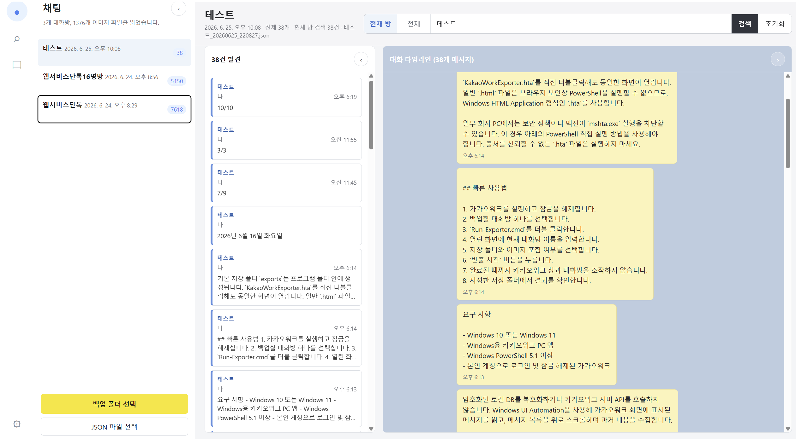

# 통합 백업 뷰어 사용법

여러 대화방을 각각 백업한 뒤에는 `Open-BackupViewer.cmd`로 통합 뷰어를 열어 한 화면에서 검색할 수 있습니다.
통합 뷰어는 브라우저에서 실행되는 로컬 HTML이며, 사용자가 직접 선택한 폴더 안의 백업 JSON과 이미지 폴더만 읽습니다.

## 화면 구성

| 영역 | 설명 |
| --- | --- |
| 왼쪽 채팅방 목록 | 불러온 백업 JSON을 대화방 단위로 보여줍니다. 대화방을 누르면 오른쪽에 해당 대화 타임라인이 열립니다. |
| 왼쪽 아래 버튼 | **백업 폴더 선택**, **JSON 파일 선택**으로 백업 파일을 불러옵니다. |
| 상단 검색 영역 | **현재 방** 또는 **전체** 범위를 고른 뒤 검색어를 입력합니다. |
| 가운데 검색 결과 | 검색된 메시지 목록입니다. 결과를 누르면 해당 대화방과 메시지 위치로 이동합니다. |
| 오른쪽 대화 타임라인 | 선택한 대화방의 전체 메시지를 카카오워크와 비슷한 형태로 보여줍니다. |

## 백업 불러오기

1. `Open-BackupViewer.cmd`를 더블 클릭합니다.
2. 왼쪽 채팅방 목록 아래의 **백업 폴더 선택**을 누릅니다.
3. `exports` 폴더, 프로젝트 폴더, 또는 여러 백업 폴더를 모아 둔 상위 폴더를 선택합니다.
4. 왼쪽 채팅방 목록에 대화방이 표시되면 볼 대화방을 선택합니다.

이미지를 함께 보려면 JSON 파일과 같은 이름의 `_images` 폴더가 선택한 폴더 안에 함께 있어야 합니다.
브라우저 보안 때문에 사용자가 선택하지 않은 폴더는 자동으로 읽을 수 없습니다.

Chrome 또는 Edge에서 **백업 폴더 선택**으로 폴더를 불러오면, 뷰어가 선택한 폴더 정보를 브라우저에 저장합니다.
다음에 `Open-BackupViewer.cmd`를 다시 열 때 브라우저가 권한을 유지하고 있으면 같은 폴더를 자동으로 다시 읽습니다.
권한이 만료되었거나 브라우저가 폴더 접근을 다시 확인해야 하는 경우에는 백업 폴더를 다시 선택해야 합니다.
**JSON 파일 선택**으로 개별 파일만 고른 경우에는 브라우저 보안상 경로를 저장할 수 없습니다.

## 검색하기

1. 상단 검색 영역에서 **현재 방** 또는 **전체**를 선택합니다.
2. 검색창에 대화방 이름, 발신자, 메시지 본문을 입력합니다.
3. **검색**을 누르거나 Enter를 누릅니다.
4. 가운데 검색 결과에서 원하는 항목을 누릅니다.
5. 오른쪽 대화 타임라인이 해당 메시지 위치로 이동하고 메시지가 강조됩니다.

시간과 날짜는 검색 대상에서 제외됩니다. 숫자나 오전/오후 같은 값 때문에 불필요한 결과가 많이 나오는 것을 줄이기 위해서입니다.

## 접기와 펼치기

- 왼쪽 채팅방 목록은 목록 상단의 `‹` 버튼으로 접고, 왼쪽 레일의 채팅 아이콘으로 다시 열 수 있습니다.
- 가운데 검색 결과는 패널 제목 오른쪽의 원형 버튼으로 접고 펼칠 수 있습니다.
- 오른쪽 대화 타임라인도 패널 제목 오른쪽의 원형 버튼으로 접고 펼칠 수 있습니다.

작은 화면에서는 필요 없는 영역을 접어 검색 결과나 대화 타임라인을 더 넓게 볼 수 있습니다.

## 메시지 표시 기준

- 발신자 이름이 없는 메시지는 내가 보낸 메시지로 보고 오른쪽에 표시합니다.
- 발신자 이름이 있는 메시지는 다른 사람이 보낸 메시지로 보고 왼쪽에 표시합니다.
- 이미지가 있는 메시지는 `_images` 폴더에서 같은 파일을 찾을 수 있을 때 함께 표시합니다.

## 자주 막히는 문제

| 증상 | 해결 방법 |
| --- | --- |
| 대화방 목록이 비어 있음 | **백업 폴더 선택**으로 JSON 파일이 들어 있는 폴더를 선택했는지 확인하세요. |
| 이미지가 보이지 않음 | JSON 파일과 같은 이름의 `_images` 폴더까지 함께 선택했는지 확인하세요. |
| 검색 결과가 너무 많음 | 더 구체적인 단어로 다시 검색하세요. 결과 목록은 처음 500건까지만 표시됩니다. |
| 전체 검색 결과를 눌렀는데 다른 방으로 이동함 | 정상 동작입니다. 전체 검색은 모든 대화방에서 찾은 뒤, 결과가 속한 대화방으로 이동합니다. |
